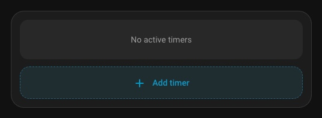
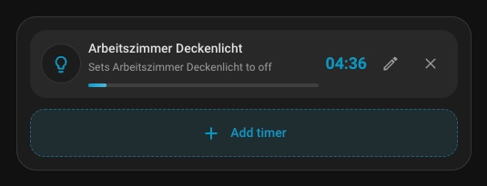
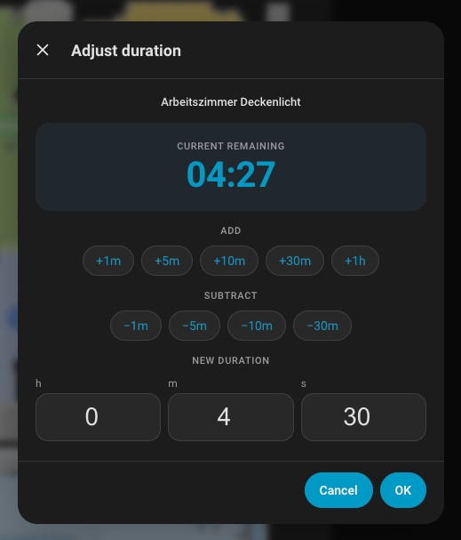
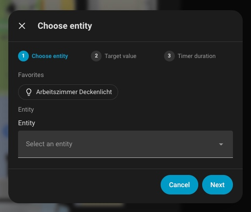
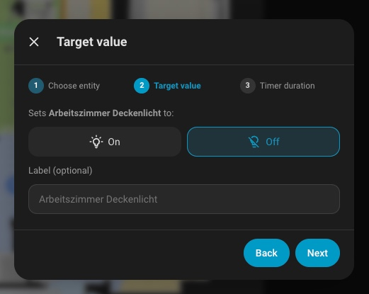
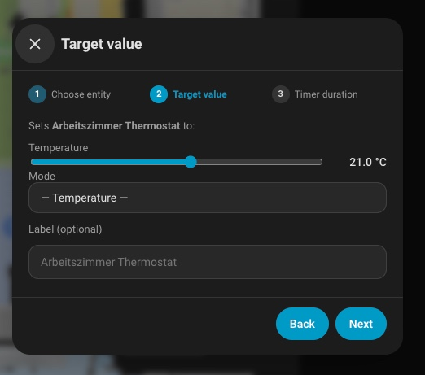
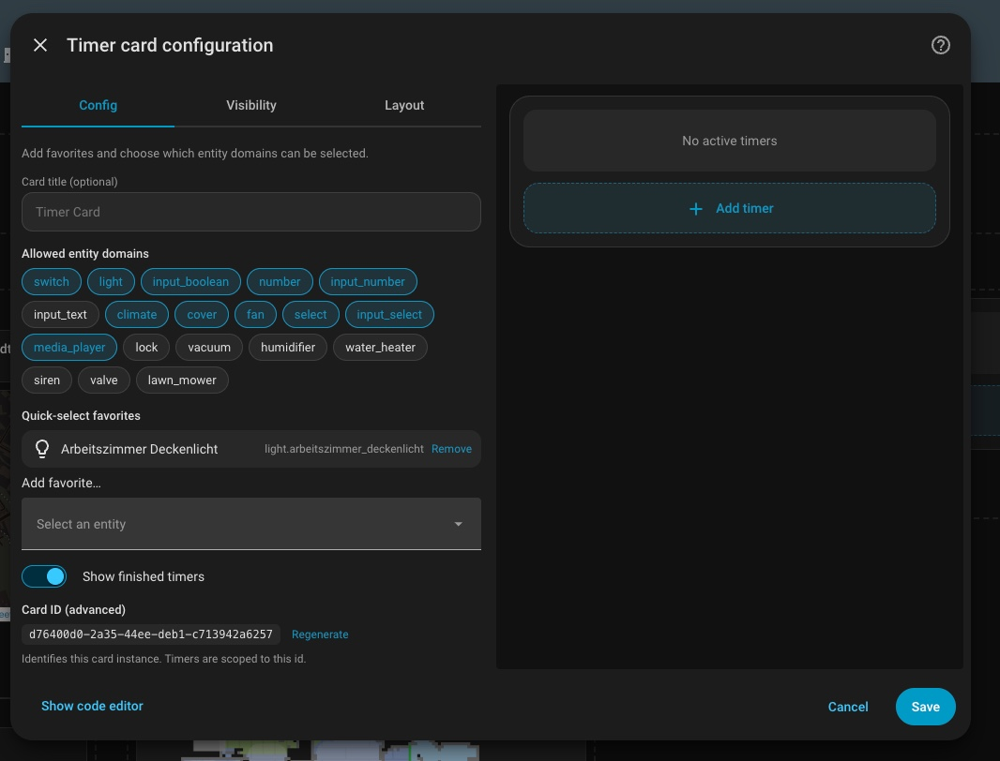

# Timer Card for Home Assistant

[](https://github.com/NuIIPointer/ha-timer-card/actions/workflows/hacs.yaml)
[](https://github.com/NuIIPointer/ha-timer-card/actions/workflows/validate.yaml)
[](https://github.com/NuIIPointer/ha-timer-card/releases)
[](LICENSE)
[](https://github.com/hacs/integration)

A modern Lovelace card that lets you create one-shot timers from your dashboard. When a timer expires, the integration sets the entity you chose to the value you picked. Works with switches, lights, numbers, climate, covers, fans, selects, media players, locks, vacuums, humidifiers, water heaters, sirens, valves and lawn mowers. Timers run server-side and survive Home Assistant restarts.

> **TL;DR** — Add the card to a dashboard, tap **+ Add timer**, pick an entity, pick a target state, pick a duration or absolute time, done. The integration takes care of firing the right service when the time is up.

---

## Screenshots

> 📸 _Replace the placeholders below with your own screenshots. Drop the images into `docs/` (or any folder you like) and update the paths._

| Empty card on a dashboard | Active timer with countdown | Edit running timer |
| --- | --- | --- |
|  |  |  |

| Entity-picker dialog | Target-value picker (type-aware) | Visual editor with favourites |
| --- | --- | --- |
|  |   |  |

---

## Features

- **Initial dashboard state is just a single „+ Add timer" button.** Tap it → multi-step dialog: pick entity → choose target value (type-aware picker) → pick duration or absolute time.
- **Multiple timers per card** with independent countdowns, progress bars, edit and delete buttons.
- **Edit running timers**: pencil icon opens an adjust-duration dialog with quick +/− buttons (1m, 5m, 10m, 30m, 1h) and absolute HH:MM:SS entry.
- **Finished timers** stay visible for 30 minutes (configurable in code), then auto-purge.
- **Card editor** supports favourite entities (shown as quick-select chips in the dialog) and entity-domain filters.
- **Server-side execution** via a custom integration — no extra automations needed and timers survive restarts.
- **24 bundled languages**: `en, de, fr, es, it, nl, pt, pl, sv, da, nb, fi, cs, sk, hu, ru, uk, tr, ja, zh-Hans, ko, ca, ro, el` — automatically follows `hass.locale.language`.
- **Only controllable entity domains are selectable** — read-only sensors / cameras / calendars are filtered out.
- **`timer_card_finished` event** is fired for each expired timer, ready to be used in your own automations.

---

## Installation

### Method 1 — One-click install via HACS (recommended)

> Requires [HACS](https://hacs.xyz) ≥ 2.0 already installed.

Click the button below to add Timer Card as a custom HACS repository on your Home Assistant instance:

[](https://my.home-assistant.io/redirect/hacs_repository/?owner=NuIIPointer&repository=ha-timer-card&category=integration)

Then click **Download** → **Restart Home Assistant**.

After the restart, click the button below to add the integration:

[](https://my.home-assistant.io/redirect/config_flow_start/?domain=timer_card)

Finally add the card to any dashboard: **Edit dashboard → Add card → search „Timer Card"**.

### Method 2 — Manual HACS install

1. In Home Assistant, open **HACS** from the sidebar.
2. Click the **⋮** menu (top right) → **Custom repositories**.
3. Paste `https://github.com/NuIIPointer/ha-timer-card` into _Repository_.
4. Choose **Integration** in _Type_ → **Add**.
5. Back on the HACS dashboard, search for **Timer Card** → **Download** → **Restart Home Assistant**.
6. After restart, go to **Settings → Devices & Services → Add Integration → Timer Card** (or use the button below).

   [](https://my.home-assistant.io/redirect/config_flow_start/?domain=timer_card)

7. Add the card to any dashboard: **Edit dashboard → Add card → search „Timer Card"**.

### Method 3 — Manual installation (without HACS, via Samba / FTPS / Studio Code Server)

1. Download the latest release from the [releases page](https://github.com/NuIIPointer/ha-timer-card/releases).
2. Extract the archive.
3. Copy the folder `custom_components/timer_card/` from the archive into your Home Assistant `config/custom_components/` directory. The result should look like:
   ```
   config/
   └── custom_components/
       └── timer_card/
           ├── __init__.py
           ├── manifest.json
           ├── timer-card.js
           └── …
   ```
4. **Restart Home Assistant.**
5. Add the integration via **Settings → Devices & Services → Add Integration → Timer Card**, or use the button:

   [](https://my.home-assistant.io/redirect/config_flow_start/?domain=timer_card)

6. Add the card to a dashboard: **Edit dashboard → Add card → search „Timer Card"**.

> The integration auto-registers the Lovelace card asset (`/timer_card_static/timer-card.js`) and injects it as an extra-JS module on every dashboard load — **no manual resource registration needed**.

### Manage an existing install

Already installed? Jump straight to the integration's configuration page:

[](https://my.home-assistant.io/redirect/integration/?domain=timer_card)

---

## Usage

After installing the integration and adding the card to a dashboard:

1. Click **+ Add timer**.
2. **Step 1 — Entity**: pick a favourite chip (configured in the card editor) or search any controllable entity.
3. **Step 2 — Target value**: choose what the entity should be set to. The picker adapts to the entity type:
   * Light / switch / input\_boolean → On / Off (light additionally gets a brightness slider)
   * Number / input\_number → numeric slider + box
   * Climate → temperature slider, optionally HVAC mode
   * Cover → Open / Close / set position
   * Fan → Off / percentage
   * Select / input\_select → dropdown of the entity's options
   * Media player → Play / Pause / Stop / On / Off
   * Lock → Lock / Unlock
   * Vacuum → Start / Pause / Dock / Stop
   * Humidifier / water heater → On / Off + humidity / temperature target
   * Lawn mower → Start / Pause / Dock
4. **Step 3 — When**: switch between **Duration** (`HH:MM:SS` + quick `+15min / +30min / +1h` buttons) or **Time** (absolute time-of-day; if in the past it fires next day in HA's local time zone).
5. Confirm with **OK**. The dialog closes and the timer appears in the card with a live countdown.

Repeat for as many parallel timers as you want — each card maintains its own list scoped by an internal `card_id`.

---

## Configuration

The card has a visual editor (HA dashboard → edit card → Timer Card → ⋮ → Configure). The same options are also editable as YAML:

```yaml
type: custom:timer-card
title: Bath timers          # optional
card_id: 5b7e0c0e-…         # auto-generated UUID; do not edit unless you know what you're doing
favorites:                  # quick-select chips inside the entity picker
  - switch.bathroom_light
  - climate.bathroom_floor
  - cover.bathroom_blinds
domains:                    # which entity domains the picker offers
  - switch
  - light
  - input_boolean
  - climate
  - cover
show_finished: true         # show finished timers for 30 min
```

All fields are optional except the auto-generated `card_id`.

---

## Services

The integration exposes four services. The visual card uses them under the hood, but you can also call them from automations / scripts.

| Service | Required fields | Optional fields | What it does |
| --- | --- | --- | --- |
| `timer_card.create` | `card_id`, `entity_id`, `target_value`, `duration` | `label` | Creates a new timer. Returns `{timer_id: …}` (use `response_variable:` to capture it). |
| `timer_card.update` | `timer_id` | `duration` *or* `delta` | Updates a running timer's remaining time. `duration` = new absolute seconds from now; `delta` = positive/negative seconds to add. |
| `timer_card.delete` | `timer_id` | – | Cancels a running timer without firing the action. |
| `timer_card.clear_finished` | – | `card_id` | Removes finished entries from the visible history. |

Example automation that creates a 20-minute „turn the kitchen light off" timer when motion stops:

```yaml
trigger:
  - platform: state
    entity_id: binary_sensor.kitchen_motion
    to: "off"
    for: "00:00:30"
action:
  - service: timer_card.create
    data:
      card_id: kitchen
      entity_id: light.kitchen
      target_value: "off"
      duration: 1200
      label: Auto-off after no motion
```

---

## Events

The integration fires `timer_card_finished` whenever a timer expires. Event data:

```yaml
timer_id: <uuid>
card_id: <the card_id that owns this timer>
entity_id: <which entity was targeted>
target_value: <the value the entity was set to>
label: <optional user label>
```

Use it in an automation:

```yaml
trigger:
  - platform: event
    event_type: timer_card_finished
action:
  - service: notify.mobile_app_phone
    data:
      title: Timer fertig
      message: "{{ trigger.event.data.entity_id }} → {{ trigger.event.data.target_value }}"
```

---

## How it works

The package ships **one HACS integration** that contains both the Python backend and the Lovelace card asset:

```
custom_components/timer_card/
├── __init__.py          # Services, persistence, scheduling, frontend hook
├── manifest.json
├── config_flow.py       # UI install ("Add Integration → Timer Card")
├── const.py
├── sensor.py            # sensor.timer_card — attributes = active + finished timers
├── services.yaml
├── timer-card.js        # Lovelace card (served via /timer_card_static/timer-card.js)
└── translations/        # 24 languages
```

- Timers are persisted to `.storage/timer_card.timers` (HA's `Store` helper) and rescheduled with `async_call_later` on every HA start. Anything that should have already fired during downtime fires immediately on startup.
- A single sensor `sensor.timer_card` exposes all running + recently-finished timers as state attributes. The Lovelace card filters server-side timers by `card_id` so multiple card instances on different dashboards stay separated.
- Finished timers are kept for 30 minutes in the sensor's `finished` attribute, then auto-purged by a periodic GC.

---

## Troubleshooting

- **„sensor.timer_card not found" inside the card**
  The integration isn't installed or hasn't loaded yet. Make sure you've completed step 5 of the Install section (Settings → Devices & Services → Add Integration → Timer Card) and restarted HA.
- **„Konfigurationsfehler / No card type configured" after editing the card**
  Hard-reload the browser (Cmd/Ctrl + Shift + R) — the cached card JS is out of date. Each release ships with a cache-busting version query parameter.
- **A timer doesn't fire after HA restart**
  Check that the entity_id still exists. If you've renamed an entity, the timer references the old name. Delete and recreate it.
- **My language isn't in the list**
  English is used as fallback. You can contribute a new language by submitting a PR — add a translation block to the `STRINGS` object in `custom_components/timer_card/timer-card.js` plus a `translations/<lang>.json` for the config flow.

---

## Contributing

Issues and PRs welcome. For new features please open an issue first to discuss the design. For translations: see the note in Troubleshooting — translations are very low-friction and welcome from anyone.

---

## License

[MIT](LICENSE)
